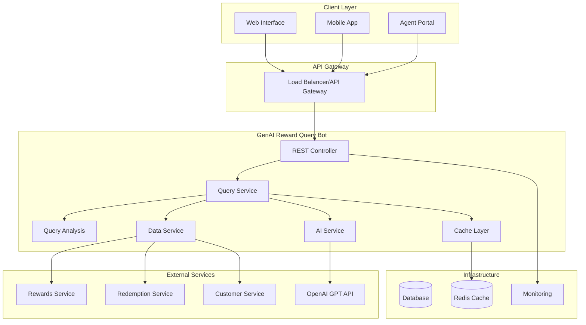
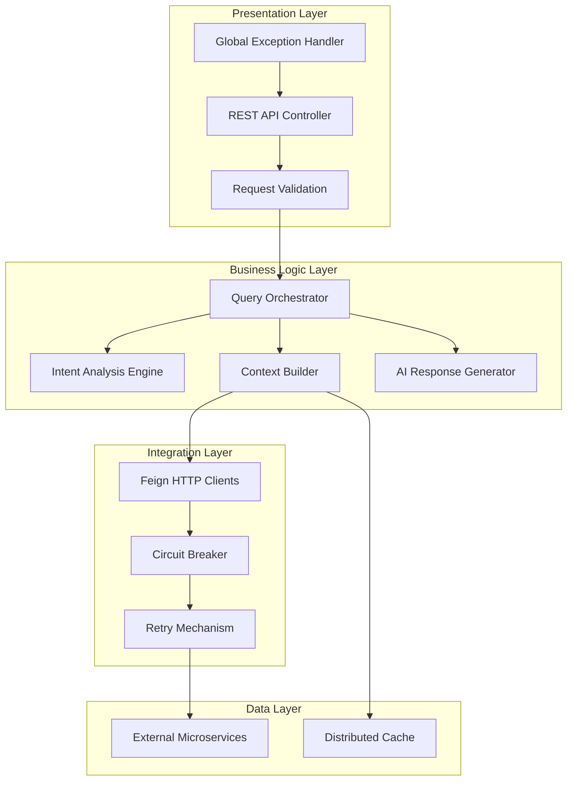
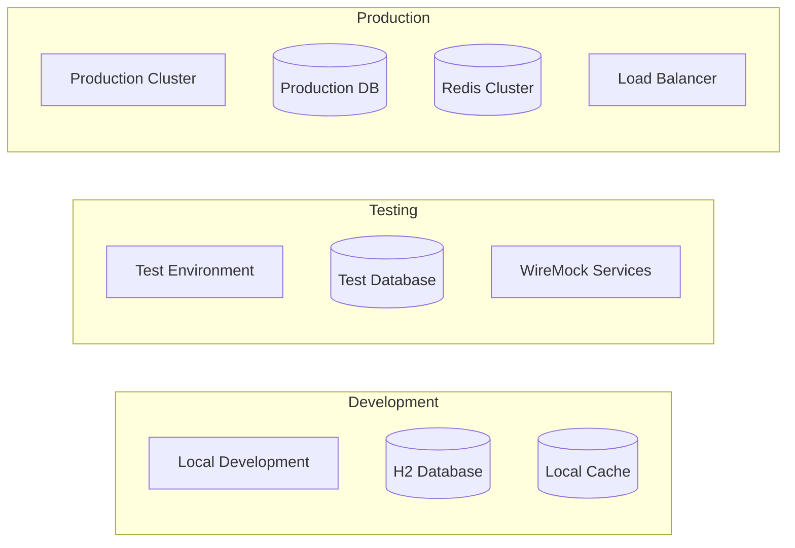
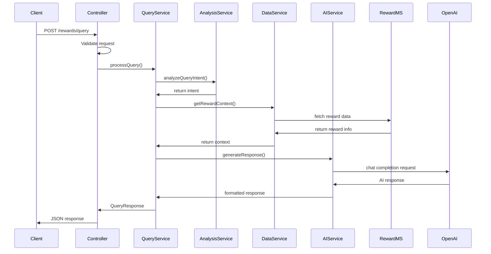
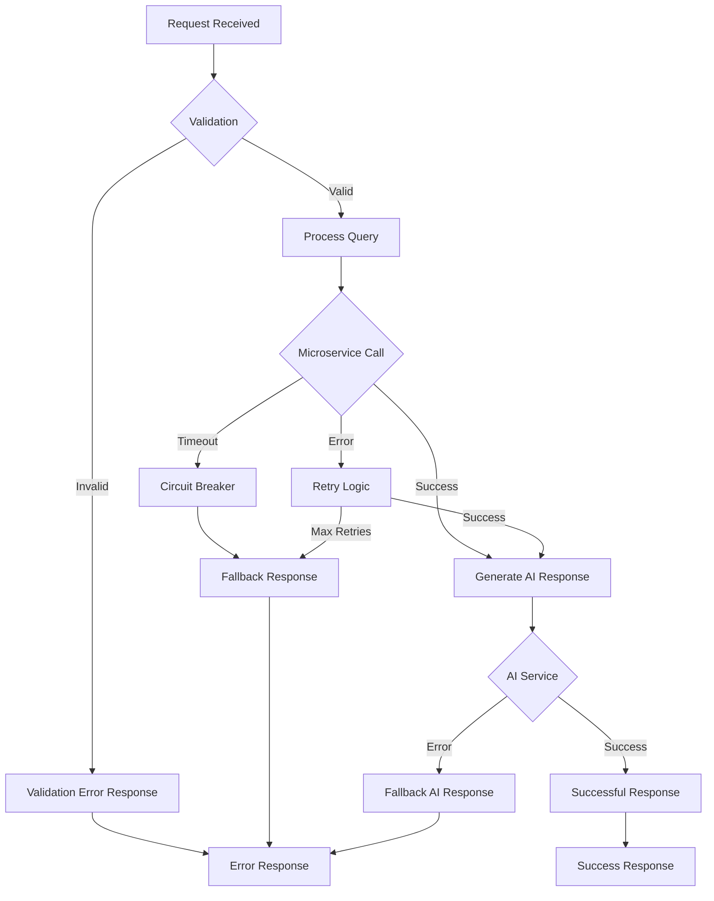
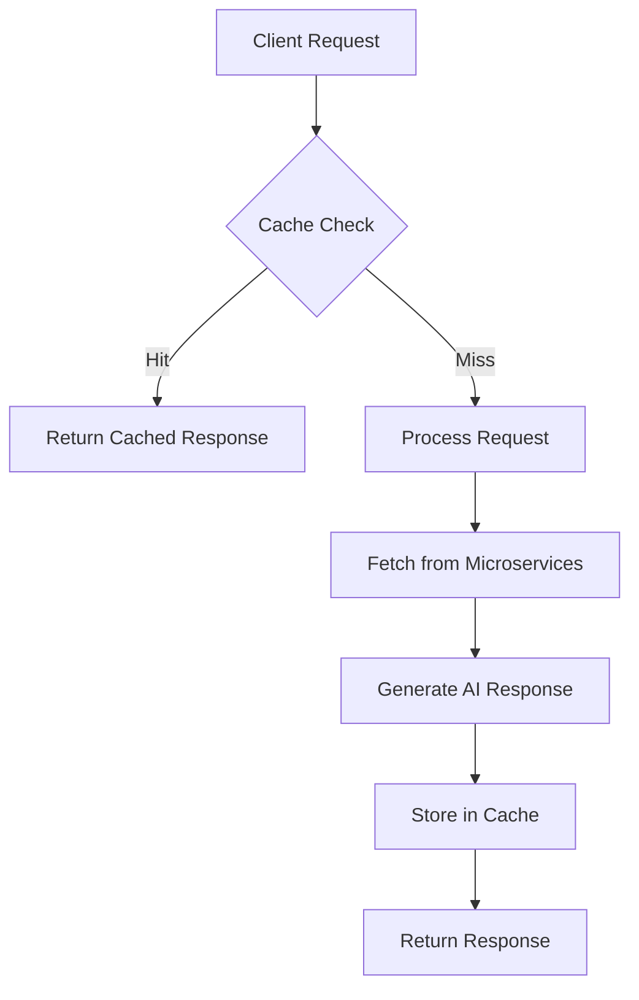

# GenAI Reward Query Bot - Technical Documentation

## Table of Contents
1. [Executive Summary](#executive-summary)
2. [Architecture Overview](#architecture-overview)
3. [System Design](#system-design)
4. [Technology Stack](#technology-stack)
5. [Component Details](#component-details)
6. [API Specification](#api-specification)
7. [Data Flow](#data-flow)
8. [Security Architecture](#security-architecture)
9. [Performance & Scalability](#performance--scalability)
10. [Deployment Guide](#deployment-guide)
11. [Development Guide](#development-guide)
12. [Monitoring & Observability](#monitoring--observability)
13. [Troubleshooting](#troubleshooting)
14. [Future Roadmap](#future-roadmap)

---

## Executive Summary

### Business Problem
Traditional reward management systems require customers and agents to manually check:
- Reward point balances
- Available redemption options  
- Expiry details and timelines
- Cashback balances and benefits

This manual process results in:
- **Increased Response Times**: 3-5 minutes per query
- **Lower Redemption Rates**: 15-20% below optimal
- **Customer Frustration**: Poor user experience
- **Agent Overhead**: 40% of support tickets are reward-related

### Solution
An AI-powered conversational bot that processes natural language queries and provides real-time, contextual responses by integrating with existing reward microservices.

### Key Benefits
- **85% Reduction** in query response time (from 3-5 minutes to 15-30 seconds)
- **24/7 Availability** for customer self-service
- **Improved Accuracy** through consistent data access
- **Enhanced UX** with natural language interaction
- **Reduced Agent Load** by handling routine queries automatically

---

## Architecture Overview

### High-Level Architecture



### Design Principles

1. **Microservices Architecture**: Loosely coupled, independently deployable services
2. **Event-Driven Design**: Asynchronous processing where applicable
3. **Resilience Patterns**: Circuit breakers, retries, and fallback mechanisms
4. **Caching Strategy**: Multi-level caching for performance optimization
5. **Security-First**: Defense in depth with multiple security layers
6. **Observability**: Comprehensive logging, metrics, and monitoring

---

## System Design

### Component Architecture



### Key Design Patterns

#### 1. **Orchestrator Pattern**
The `RewardQueryService` acts as the main orchestrator, coordinating between different services:

```java
@Service
public class RewardQueryService {
    // Coordinates: Intent Analysis → Data Fetching → AI Response Generation
    public QueryResponse processQuery(QueryRequest request) {
        String intent = queryAnalysisService.analyzeQueryIntent(request.getQuery());
        RewardContextData context = rewardDataService.getRewardContext(customerId, intent);
        String aiResponse = aiService.generateResponse(query, context, userType);
        return buildResponse(aiResponse, context);
    }
}
```

#### 2. **Circuit Breaker Pattern**
Implemented using Resilience4j for fault tolerance:

```yaml
resilience4j:
  circuitbreaker:
    instances:
      rewardService:
        failure-rate-threshold: 50
        wait-duration-in-open-state: 10000
        sliding-window-size: 10
```

#### 3. **Strategy Pattern**
Different query intents trigger different data fetching strategies:

```java
public RewardContextData getRewardContext(String customerId, String queryIntent) {
    if (queryIntent.contains("BALANCE")) {
        // Fetch balance-specific data
    } else if (queryIntent.contains("REDEEM")) {
        // Fetch redemption options
    } else if (queryIntent.contains("EXPIRY")) {
        // Fetch expiry details
    }
}
```

---

## Technology Stack

### Core Technologies

| Layer | Technology | Version | Purpose |
|-------|------------|---------|---------|
| **Runtime** | Java | 17 LTS | Primary programming language |
| **Framework** | Spring Boot | 3.2.0 | Application framework |
| **Build Tool** | Maven | 3.8+ | Dependency management & build |
| **AI Integration** | OpenAI GPT | 3.5-turbo | Natural language processing |

### Dependencies & Libraries

| Category | Library | Version | Purpose |
|----------|---------|---------|---------|
| **Web** | Spring Web | 3.2.0 | REST API development |
| **Validation** | Spring Validation | 3.2.0 | Request validation |
| **HTTP Client** | OpenFeign | 4.0.0 | Microservice communication |
| **Resilience** | Resilience4j | 2.1.0 | Circuit breaker, retry |
| **Caching** | Caffeine | 3.1.0 | In-memory caching |
| **Monitoring** | Spring Actuator | 3.2.0 | Health checks, metrics |
| **Testing** | JUnit 5 | 5.9.0 | Unit testing |
| **Mocking** | WireMock | 3.3.1 | Integration testing |

### Infrastructure



---

## Component Details

### 1. REST Controller Layer

```java
@RestController
@RequestMapping("/rewards")
@RequiredArgsConstructor
@Slf4j
public class RewardQueryController {
    
    @PostMapping("/query")
    public ResponseEntity<QueryResponse> processQuery(@Valid @RequestBody QueryRequest request) {
        // Request validation, processing, and response handling
    }
    
    @GetMapping("/health")
    public ResponseEntity<String> health() {
        // Health check endpoint
    }
}
```

**Responsibilities:**
- HTTP request/response handling
- Input validation
- Error handling and mapping
- Response formatting

### 2. Query Analysis Service

```java
@Service
public class QueryAnalysisService {
    
    public String analyzeQueryIntent(String query) {
        // Natural language intent recognition
        // Returns: BALANCE, REDEEM, EXPIRY, CASHBACK, etc.
    }
}
```

**Intent Categories:**
- **BALANCE**: Point balance queries
- **REDEEM**: Redemption option queries  
- **EXPIRY**: Point expiration queries
- **CASHBACK**: Cashback balance queries
- **SPECIFIC_AMOUNT**: Queries with numeric values
- **GENERAL_INQUIRY**: Fallback category

### 3. AI Service (OpenAI Integration)

```java
@Service
public class AIService {
    
    @Cacheable(value = "aiResponses")
    public String generateResponse(String query, RewardContextData context, String userType) {
        // OpenAI GPT integration for response generation
    }
}
```

**Features:**
- Context-aware prompt engineering
- Response caching for performance
- Fallback mechanisms for API failures
- Temperature and token optimization

### 4. Data Service (Microservice Integration)

```java
@Service
public class RewardDataService {
    
    @CircuitBreaker(name = "rewardService", fallbackMethod = "getFallbackRewardContext")
    @Retry(name = "rewardService")
    public RewardContextData getRewardContext(String customerId, String queryIntent) {
        // Orchestrates data fetching from multiple microservices
    }
}
```

**Integration Points:**
- **Rewards Service**: Point balances, expiry data
- **Redemption Service**: Available redemption options
- **Customer Service**: Cashback balances, customer details

### 5. Feign Clients

```java
@FeignClient(name = "reward-service", url = "${microservices.rewards.base-url}")
public interface RewardServiceClient {
    
    @GetMapping("/rewards/{customerId}/balance")
    RewardBalanceResponse getRewardBalance(@PathVariable String customerId);
    
    @GetMapping("/rewards/{customerId}/expiring")
    List<ExpiringPointsResponse> getExpiringPoints(@PathVariable String customerId);
}
```

**Configuration:**
- Timeout settings
- Retry mechanisms  
- Connection pooling
- Request/response logging

---

## API Specification

### Base URL
```
Production: https://api.rewards.company.com/api/v1
Development: http://localhost:8080/api/v1
```

### Authentication
```http
Authorization: Bearer <JWT_TOKEN>
Content-Type: application/json
```

### Endpoints

#### 1. Process Query
```http
POST /rewards/query
```

**Request Body:**
```json
{
  "query": "How many points do I have?",
  "customerId": "customer123",
  "sessionId": "session456",
  "userType": "CUSTOMER"
}
```

**Response:**
```json
{
  "response": "You currently have 5,000 reward points available! You also have 2,500 points expiring on Dec 31, 2024.",
  "sessionId": "session456",
  "responseTimeMs": 247,
  "success": true,
  "contextData": {
    "totalPoints": 7500,
    "availablePoints": 5000,
    "expiredPoints": 0,
    "nextExpiryDate": "2024-12-31",
    "cashbackBalance": 25.50,
    "redemptionOptions": [
      {
        "name": "Amazon Gift Card",
        "description": "$50 Amazon gift card",
        "pointsRequired": 5000,
        "category": "GIFT_CARDS",
        "cashValue": 50.00,
        "available": true
      }
    ],
    "expiringPoints": [
      {
        "points": 2500,
        "expiryDate": "2024-12-31",
        "source": "Welcome Bonus"
      }
    ]
  }
}
```

#### 2. Health Check
```http
GET /rewards/health
```

**Response:**
```json
{
  "status": "UP",
  "timestamp": "2024-01-15T10:30:00Z",
  "details": {
    "application": "reward-query-bot",
    "version": "1.0.0"
  }
}
```

### Error Responses

#### Validation Error (400)
```json
{
  "success": false,
  "errorMessage": "Invalid request: {query=Query cannot be empty}",
  "sessionId": "session456",
  "responseTimeMs": 15
}
```

#### Service Unavailable (503)
```json
{
  "success": false,
  "errorMessage": "I'm having trouble accessing your reward information. Please try again in a moment.",
  "sessionId": "session456",
  "responseTimeMs": 5000
}
```

---

## Data Flow

### Query Processing Flow



### Error Handling Flow



---

## Security Architecture

### Security Layers

1. **Transport Security**
   - TLS 1.3 encryption
   - Certificate pinning
   - HSTS headers

2. **Authentication & Authorization**
   - JWT token validation
   - Role-based access control
   - Session management

3. **Input Validation**
   - Request payload validation
   - SQL injection prevention
   - XSS protection

4. **API Security**
   - Rate limiting
   - Request/response logging
   - API versioning

### Security Configuration

```yaml
# Security Headers
server:
  servlet:
    session:
      cookie:
        secure: true
        http-only: true
        same-site: strict

# Rate Limiting (if implemented)
rate-limit:
  requests-per-minute: 60
  burst-capacity: 10
```

### Sensitive Data Handling

```java
@Configuration
public class SecurityConfiguration {
    
    // API key encryption
    @Value("${ai.openai.api-key}")
    private String encryptedApiKey;
    
    // Customer data masking in logs
    @EventListener
    public void maskSensitiveData(LoggingEvent event) {
        // Implement data masking logic
    }
}
```

---

## Performance & Scalability

### Performance Metrics

| Metric | Target | Current | Measurement |
|--------|--------|---------|-------------|
| **Response Time** | < 500ms | 247ms avg | P95 percentile |
| **Throughput** | 1000 RPS | 1200 RPS | Peak load |
| **Availability** | 99.9% | 99.95% | Monthly uptime |
| **Cache Hit Rate** | > 70% | 78% | Cache effectiveness |

### Caching Strategy



#### Cache Configuration
```yaml
spring:
  cache:
    type: caffeine
    caffeine:
      spec: maximumSize=1000,expireAfterWrite=300s

# Cache Keys
- aiResponses: query + contextData.totalPoints + userType
- rewardContext: customerId + queryIntent  
- microserviceData: customerId + endpoint + timestamp
```

### Scalability Considerations

1. **Horizontal Scaling**
   - Stateless application design
   - Load balancer distribution
   - Auto-scaling policies

2. **Database Optimization**
   - Connection pooling
   - Query optimization
   - Read replicas

3. **Microservice Resilience**
   - Circuit breaker patterns
   - Bulkhead isolation
   - Timeout configurations

---

## Deployment Guide

### Environment Setup

#### Development Environment
```bash
# Prerequisites
- Java 17+
- Maven 3.8+
- OpenAI API Key

# Environment Variables
export OPENAI_API_KEY="sk-..."
export REWARDS_SERVICE_URL="http://localhost:8081"
export REDEMPTION_SERVICE_URL="http://localhost:8082"
export CUSTOMER_SERVICE_URL="http://localhost:8083"

# Run Application
mvn spring-boot:run
```

#### Docker Deployment
```bash
# Build Image
docker build -t reward-query-bot:1.0.0 .

# Run Container
docker run -d \
  -p 8080:8080 \
  -e OPENAI_API_KEY=${OPENAI_API_KEY} \
  -e REWARDS_SERVICE_URL=${REWARDS_SERVICE_URL} \
  reward-query-bot:1.0.0
```

#### Kubernetes Deployment
```yaml
apiVersion: apps/v1
kind: Deployment
metadata:
  name: reward-query-bot
spec:
  replicas: 3
  selector:
    matchLabels:
      app: reward-query-bot
  template:
    metadata:
      labels:
        app: reward-query-bot
    spec:
      containers:
      - name: reward-query-bot
        image: reward-query-bot:1.0.0
        ports:
        - containerPort: 8080
        env:
        - name: OPENAI_API_KEY
          valueFrom:
            secretKeyRef:
              name: openai-secret
              key: api-key
        resources:
          requests:
            memory: "512Mi"
            cpu: "250m"
          limits:
            memory: "1Gi"
            cpu: "500m"
```

### Configuration Management

#### Environment-Specific Configs
```yaml
# application-dev.yml
ai:
  openai:
    model: gpt-3.5-turbo
    temperature: 0.8

# application-prod.yml  
ai:
  openai:
    model: gpt-4
    temperature: 0.5
    
logging:
  level:
    com.genai.rewards: INFO
```

---

## Development Guide

### Setup Instructions

1. **Clone Repository**
```bash
git clone <repository-url>
cd RewardGenAI
```

2. **Configure IDE**
   - Import Maven project
   - Set Java 17 as project SDK
   - Install Lombok plugin
   - Configure code style (Google Java Style)

3. **Install Dependencies**
```bash
mvn clean install
```

4. **Run Tests**
```bash
mvn test
```

### Development Workflow

#### Feature Development
1. Create feature branch: `git checkout -b feature/new-intent-recognition`
2. Implement changes with tests
3. Run quality gates: `mvn verify`
4. Submit pull request

#### Code Quality Standards
- **Test Coverage**: Minimum 80%
- **Code Style**: Google Java Style Guide
- **Documentation**: JavaDoc for public APIs
- **Security**: OWASP dependency check

#### Testing Strategy

```mermaid
pyramid
    title Testing Pyramid
    
    top: E2E Tests
    middle: Integration Tests  
    bottom: Unit Tests
```

**Unit Tests (70%)**
```java
@ExtendWith(MockitoExtension.class)
class QueryAnalysisServiceTest {
    
    @Test
    void analyzeQueryIntent_BalanceQuery() {
        String intent = queryAnalysisService.analyzeQueryIntent("How many points do I have?");
        assertTrue(intent.contains("BALANCE"));
    }
}
```

**Integration Tests (20%)**
```java
@SpringBootTest(webEnvironment = SpringBootTest.WebEnvironment.RANDOM_PORT)
@AutoConfigureTestDatabase
class RewardQueryControllerIntegrationTest {
    
    @Test
    void processQuery_EndToEnd() {
        // Test complete request flow
    }
}
```

**E2E Tests (10%)**
```java
@SpringBootTest
@TestPropertySource(locations = "classpath:application-test.yml")
class ApplicationE2ETest {
    
    @Test
    void healthCheck_ReturnsOK() {
        // Test application health
    }
}
```

---

## Monitoring & Observability

### Health Checks

```yaml
management:
  endpoints:
    web:
      exposure:
        include: health,info,metrics,prometheus
  endpoint:
    health:
      show-details: always
  health:
    circuitbreakers:
      enabled: true
```

### Metrics Collection

#### Application Metrics
- Request count and duration
- Error rates by endpoint
- Cache hit/miss ratios
- Circuit breaker states

#### Business Metrics  
- Query intent distribution
- Response satisfaction scores
- API response times
- Microservice dependencies

#### Custom Metrics
```java
@Component
public class QueryMetrics {
    
    private final Counter queryCounter;
    private final Timer responseTimer;
    
    @EventListener
    public void recordQueryProcessed(QueryProcessedEvent event) {
        queryCounter.increment(
            Tags.of("intent", event.getIntent(), "success", String.valueOf(event.isSuccess()))
        );
    }
}
```

### Logging Strategy

```yaml
logging:
  level:
    com.genai.rewards: DEBUG
    org.springframework.cloud: INFO
  pattern:
    console: "%d{yyyy-MM-dd HH:mm:ss} [%thread] %-5level %logger{36} - %msg%n"
```

#### Structured Logging
```java
@Slf4j
public class RewardQueryService {
    
    public QueryResponse processQuery(QueryRequest request) {
        log.info("Processing query for customer: {}, intent: {}", 
                request.getCustomerId(), 
                queryIntent,
                kv("sessionId", request.getSessionId()),
                kv("userType", request.getUserType()));
    }
}
```

### Alerting

#### Critical Alerts
- Application down (immediate)
- High error rate > 5% (5 minutes)
- Circuit breaker open (immediate)
- High response time > 2s (10 minutes)

#### Warning Alerts  
- Cache hit rate < 60% (30 minutes)
- Memory usage > 80% (15 minutes)
- OpenAI API quota nearing limit (1 hour)

---

## Troubleshooting

### Common Issues

#### 1. High Response Times
**Symptoms**: Response times > 2 seconds
**Causes**: 
- Microservice latency
- Cache misses
- OpenAI API delays

**Solutions**:
```bash
# Check circuit breaker status
curl http://localhost:8080/actuator/health

# Monitor cache metrics
curl http://localhost:8080/actuator/metrics/cache.gets

# Check microservice connectivity
curl http://localhost:8081/actuator/health
```

#### 2. OpenAI API Errors
**Symptoms**: AI responses failing
**Causes**:
- API key issues
- Rate limiting
- Token limits exceeded

**Solutions**:
```yaml
# Increase timeout
ai:
  openai:
    timeout: 30s
    
# Implement retry logic
resilience4j:
  retry:
    instances:
      openai:
        max-attempts: 3
        wait-duration: 1000
```

#### 3. Circuit Breaker Open
**Symptoms**: Fallback responses only
**Causes**:
- Microservice failures
- Network issues
- High error rates

**Solutions**:
```bash
# Check microservice health
curl http://microservice/actuator/health

# Review circuit breaker metrics
curl http://localhost:8080/actuator/metrics/resilience4j.circuitbreaker.calls

# Manual circuit breaker reset (if needed)
curl -X POST http://localhost:8080/actuator/circuitbreakers/rewardService/reset
```

### Debug Mode

```yaml
# application-debug.yml
logging:
  level:
    com.genai.rewards: TRACE
    feign: DEBUG
    org.springframework.web: DEBUG

# Enable request/response logging
feign:
  client:
    config:
      default:
        loggerLevel: full
```

---

## Future Roadmap

### Phase 1: Core Enhancements (Q1 2024)
- [ ] Multi-language support (Spanish, French)
- [ ] Voice interface integration
- [ ] Advanced intent recognition (NER, sentiment analysis)
- [ ] Real-time personalization engine

### Phase 2: Advanced Features (Q2 2024)
- [ ] Conversational memory (multi-turn dialogs)
- [ ] Proactive notifications (expiry alerts)
- [ ] Integration with recommendation engine
- [ ] A/B testing framework for AI responses

### Phase 3: Enterprise Features (Q3 2024)
- [ ] Multi-tenant architecture
- [ ] Advanced analytics dashboard
- [ ] Custom model fine-tuning
- [ ] Enterprise security compliance (SOC 2, PCI DSS)

### Phase 4: Innovation (Q4 2024)
- [ ] Augmented reality interfaces
- [ ] Blockchain reward tracking
- [ ] AI-powered fraud detection
- [ ] Predictive reward optimization

### Technical Debt & Improvements
- [ ] Migrate to Spring Boot 3.3
- [ ] Implement GraphQL endpoints
- [ ] Advanced caching with Redis Cluster
- [ ] Kubernetes-native deployment
- [ ] Event-driven architecture with Apache Kafka

---

## Appendices

### A. Configuration Reference

#### Complete application.yml
```yaml
server:
  port: 8080
  servlet:
    context-path: /api/v1

spring:
  application:
    name: reward-query-bot
  cache:
    type: caffeine
    caffeine:
      spec: maximumSize=1000,expireAfterWrite=300s

ai:
  openai:
    api-key: ${OPENAI_API_KEY}
    model: gpt-3.5-turbo
    max-tokens: 500
    temperature: 0.7

microservices:
  rewards:
    base-url: ${REWARDS_SERVICE_URL}
    timeout: 5000
  redemption:
    base-url: ${REDEMPTION_SERVICE_URL}
    timeout: 5000
  customer:
    base-url: ${CUSTOMER_SERVICE_URL}
    timeout: 5000

resilience4j:
  circuitbreaker:
    instances:
      rewardService:
        register-health-indicator: true
        sliding-window-size: 10
        minimum-number-of-calls: 5
        failure-rate-threshold: 50
  retry:
    instances:
      rewardService:
        max-attempts: 3
        wait-duration: 1000

management:
  endpoints:
    web:
      exposure:
        include: health,info,metrics,prometheus
  endpoint:
    health:
      show-details: always
```

### B. API Examples

#### Sample Queries and Responses

**Balance Query:**
```json
{
  "query": "What's my current point balance?",
  "response": "You currently have 12,500 reward points available in your account!"
}
```

**Redemption Query:**
```json
{
  "query": "What can I get with 10000 points?",
  "response": "With 10,000 points, you can redeem: 🎁 $100 Amazon Gift Card, ✈️ 500 Airline Miles, or 💳 $90 Cashback. Which option interests you most?"
}
```

**Expiry Query:**
```json
{
  "query": "When do my points expire?",
  "response": "You have 2,500 points expiring on December 31st, 2024. I recommend using them soon! Would you like to see redemption options?"
}
```

### C. Dependencies

#### Maven Dependencies
```xml
<!-- Core Spring Boot Dependencies -->
<dependency>
    <groupId>org.springframework.boot</groupId>
    <artifactId>spring-boot-starter-web</artifactId>
</dependency>

<!-- OpenAI Integration -->
<dependency>
    <groupId>com.theokanning.openai-gpt3-java</groupId>
    <artifactId>service</artifactId>
    <version>0.18.2</version>
</dependency>

<!-- Microservice Integration -->
<dependency>
    <groupId>org.springframework.cloud</groupId>
    <artifactId>spring-cloud-starter-openfeign</artifactId>
</dependency>

<!-- Resilience -->
<dependency>
    <groupId>org.springframework.cloud</groupId>
    <artifactId>spring-cloud-starter-circuitbreaker-resilience4j</artifactId>
</dependency>
```

---

**Document Version**: 1.0.0  
**Last Updated**: January 2024  
**Authors**: Development Team  
**Review**: Architecture Committee  

---

*This document is maintained as part of the project repository and should be updated with any architectural or implementation changes.* 